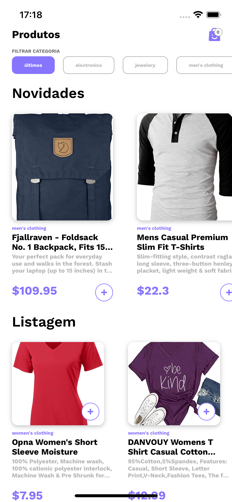
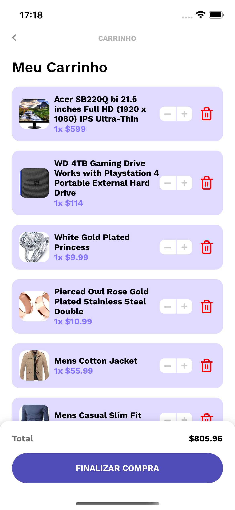

<h1 align="center">More Shop</h1>

## Proposta
<p align="left">
   O More Shop é um aplicativo ecommerce com diversas categorias e opções de compra. Com ele você pode adicionar itens no carrinho, remover e finalizar sua compra de forma rápida e fácil
</p>

<p align="center">
  <a href="https://github.com/lucasmontano">
    
  </a>
  
</p>

## Abaixo segue um print da aplicação React Native
<p align="center">
    
    
</p>

## Pré-Requisitos
* React Native 0.68.1

## Setup

### Clone

- Clone este repositório usando

```
git clone https://github.com/melieskubrick/more-checkout
```

- Após clonar o projeto por completo rode os comandos abaixo

```JAVASCRIPT
yarn
cd ios && pod install
```

## Libs Utilizadas
Aqui estão os pods que foram utilizados para a construção deste app! Estes pods agilizam e melhoram a performace da aplicação

* [axios](https://github.com/axios/axios)
<br/>O Axios é um cliente HTTP baseado em Promises para fazer requisições
* [redux](https://github.com/reduxjs/react-redux)
<br/>O Redux é uma biblioteca para armazenamento de estados de aplicações
* [polished](https://polished.js.org/)
<br/>O Polished é usado para manipulação de cores na aplicação
* [styled-components](https://styled-components.com/)
<br/>ES6 e CSS para estilizar a aplicação


 <h2 align="center">
   Made with ♥
</h2>
